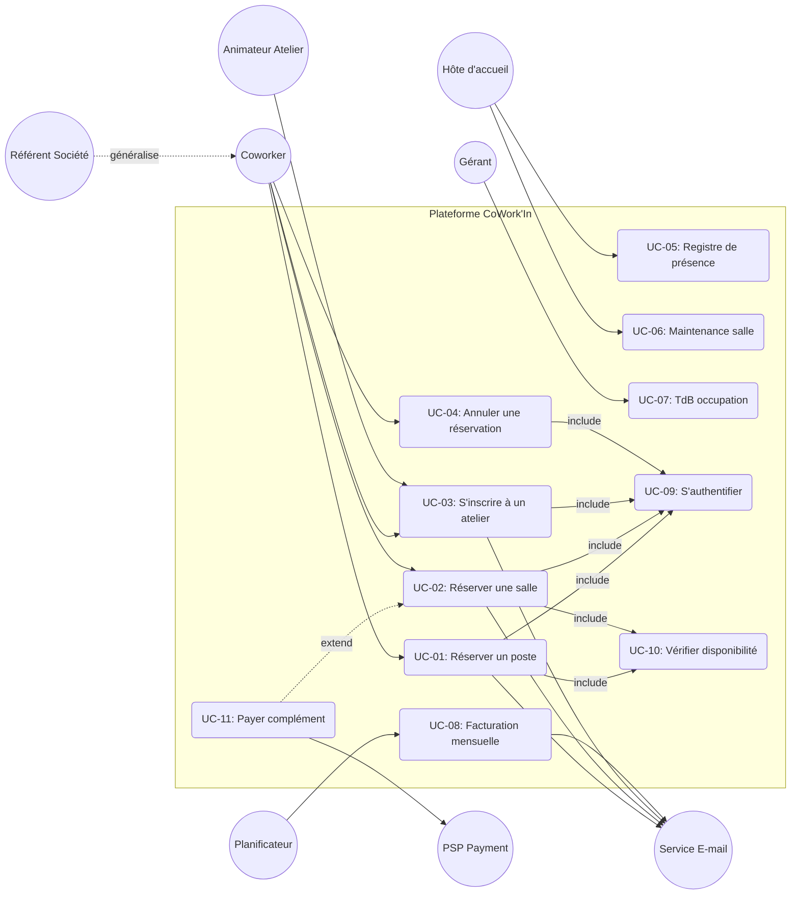

# Diagramme des Cas d'Utilisation et Matrice de Couverture — CoWork'In

## 1. Rendu Visuel (Diagramme Mermaid)

---

## 2. Justification des Frontières et des Relations

- **Frontière Système** : Tout ce qui est dans le rectangle "Plateforme CoWork'In" relève de la responsabilité du logiciel à développer. Les acteurs externes (PSP, Service E-mail, utilisateurs) se situent à l'extérieur.
- **Inclusions (`<<include>>`)** :
  - `UC-09 S'authentifier` est inclus systématiquement dans les actions nécessitant l'accès au compte client.
  - `UC-10 Vérifier disponibilité` est inclus dans la réservation de postes et salles pour empêcher les collisions.
- **Extensions (`<<extend>>`)** :
  - `UC-11 Payer le complément` est une extension facultative de `UC-02` (déclenchée uniquement si le quota d'heures gratuites est dépassé ou si l'utilisateur n'est pas abonné).

---

## 3. Matrice de Couverture Acteur x Cas d'Usage

| Acteur / UC | UC-01 Réserver poste | UC-02 Réserver salle | UC-03 Atelier | UC-04 Annuler | UC-05 Présence | UC-06 Maintenance | UC-07 TdB | UC-08 Facturation |
| :--- | :---: | :---: | :---: | :---: | :---: | :---: | :---: | :---: |
| **A1 Coworker** | X (Principal) | X (Principal) | X (Principal) | X (Principal) | - | - | - | - |
| **A2 Référent Société** | X (Hérité) | X (Hérité) | X (Hérité) | X (Hérité) | - | - | - | X (Lecture) |
| **A3 Hôte d'accueil** | - | - | - | - | X (Principal) | X (Principal) | - | - |
| **A4 Gérant** | - | - | - | - | - | - | X (Principal) | X (Validation) |
| **A5 Animateur** | - | - | X (Gestion) | - | - | - | - | - |
| **A6 PSP (Paiement)** | X (Option) | X (Option) | - | X (Remb.) | - | - | - | - |
| **A7 Service E-mail** | X (Notif) | X (Notif) | X (Notif) | X (Notif) | - | - | - | X (Facture) |
| **A8 Planificateur** | - | - | - | - | - | - | - | X (Déclencheur)|
