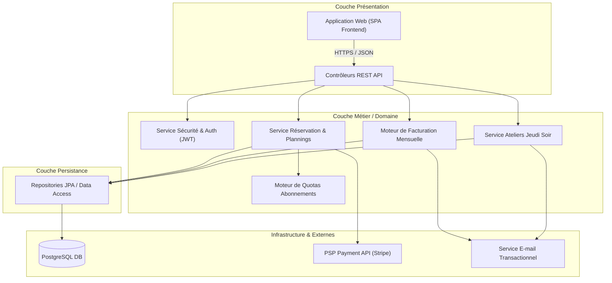

# Architecture de Composants & Fiche de Synthèse de Conception Applicative

## 1. Diagramme de Composants (Rendu Mermaid)

---

## 2. Fiche de Synthèse de Conception Applicative (Gabarit Officiel Slide 37)

### 2.1 Scénarios Modélisés et Rationale Risque
- **Scénarios retenus** : `UC-01` (Réservation poste), `UC-02` (Réservation salle + déduction quota), `UC-03` (Inscription atelier + jauge), `UC-04` (Annulation + pénalité).
- **Justification par le risque** :
  - *Risque financier & légal* : Mauvais calcul des quotas d'heures ou sur-facturation des abonnés.
  - *Risque opérationnel* : Concurrence d'accès au moment de réserver la dernière salle ou la dernière place d'un atelier.
  - *Risque sécuritaire* : Registre des présences erroné en cas d'évacuation d'un site.

---

### 2.2 Contrats des Opérations Système (API Core)

| Opération Système | Acteur Déclencheur | Données Entrantes | Données Sortantes | Effets de Bord |
| :--- | :--- | :--- | :--- | :--- |
| `POST /api/v1/reservations` | Coworker | `espaceId, dateDebut, dateFin` | `ReservationDTO` (statut, prix) | Déduction quota / Appel PSP si payant, verrou DB. |
| `DELETE /api/v1/reservations/{id}` | Coworker | `reservationId` | `CancellationDTO` (penalite, credit) | Recrédit quota / Remboursement PSP, mail notification. |
| `POST /api/v1/ateliers/{id}/inscriptions` | Coworker | `atelierId` | `InscriptionDTO` (rang) | Incrémentation `nb_inscrits` sous verrou. |
| `POST /api/v1/facturation/cloture` | Planificateur | `mois, annee` | `SummaryFacturationDTO` | Génération immuable des factures + LigneFactures. |

---

### 2.3 Découpage en Couches et Composants
- **Architecture 3-Tiers renforcée** :
  - **Présentation** : Découplée du métier (REST stateless, requêtes anonymisées ou signées par JWT).
  - **Métier** : Invariants métier et règles de gestion (RG-01 à RG-09) concentrés dans des services autonomes et testables unitairement (`QuotaService`, `ReservationService`).
  - **Données** : Couche Repository abstraite gérant le pool de connexions SQL et les transactions ACID.

---

### 2.4 Justification des Frontières de Composants
- **Séparation du Moteur de Quota (`QuotaService`)** : Bien qu'appelé uniquement lors de la réservation de salles, le moteur de quota est un composant distinct. *Raison* : Le barème de quotas est susceptible d'évoluer (ex: offres promotionnelles, formules sur-mesure pour grands comptes). Le découpler évite d'impacter la logique d'ordonnancement des réservations.

---

### 2.5 Tableau d'Analyse du Couplage et Décisions

| Point de Couplage | Type de Couplage | Risque Identifié | Décision & Justification |
| :--- | :--- | :--- | :--- |
| `ReservationService` &rarr; `PSP API` | Couplage Système Externe | Indisponibilité du service de paiement bloquant le site. | **Asynchrone via Webhook** + réservation temporaire avec TTL de 15 minutes. |
| `ReservationService` &rarr; `QuotaService` | Couplage Fort Métier | Incohérence du solde d'heures en cas d'annulation simultanée. | **Transactionnel ACID (Isolation READ_COMMITTED + Pessimistic Lock)**. |
| `FacturationService` &rarr; `NotificationService` | Couplage Événementiel | Ralentissement de la génération de factures par l'envoi de mails. | **File de messages (Queue asynchrone / RabbitMQ)**. |

---

### 2.6 Exigences Non Fonctionnelles (Sécurité, RGPD & Accessibilité)
- **Sécurité (Security by Design)** :
  - Isolation stricte des données par société (`tenant_id` ou filtrage par `societe_id`).
  - Double validation des rôles : un Hôte d'accueil ne peut accéder qu'aux présences du site qui lui est affecté.
- **RGPD & Durée de conservation** :
  - Anonymisation automatique des logs de présence physique après 3 ans.
- **Accessibilité (RGAA / WCAG 2.1 AA)** :
  - API compatible avec un front-end entièrement navigable au clavier et supportant les lecteurs d'écran.

---

### 2.7 Risques et Dettes Acceptées
- **Dette 1 : Calcul synchrone du taux d'occupation** : Accepté en V1 du fait d'une volumétrie modérée (3 sites). Un passage à une vue matérialisée ou du dénormalisé calculé par trigger sera envisagé si le réseau passe à > 10 sites.
- **Dette 2 : Agrégation des heures sur mois civil fixe** : Les quotas sont réinitialisés le 1er du mois à 00h00 sans prorata la première semaine d'inscription.
