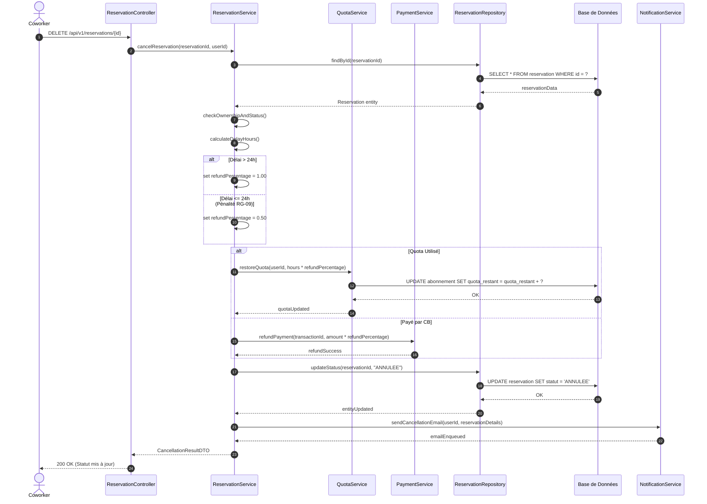

# Diagramme de Séquence Détaillée — UC-04 : Annuler une réservation

## 1. Rendu Visuel Multi-Couches (Diagramme Mermaid)

---

## 2. Opérations Méthodes Extraites pour le Diagramme de Classes

Le déroulement de ce scénario détaillé fait émerger les **méthodes et responsabilités** suivantes qui enrichissent notre modèle applicatif :

1. `ReservationService::cancelReservation(reservationId: Long, userId: Long): CancellationResultDTO`
2. `QuotaService::restoreQuota(userId: Long, hoursToRestore: Integer): Boolean`
3. `PaymentService::refundPayment(transactionId: String, amount: Decimal): PaymentStatus`
4. `ReservationRepository::updateStatus(reservationId: Long, newStatus: String): Boolean`
