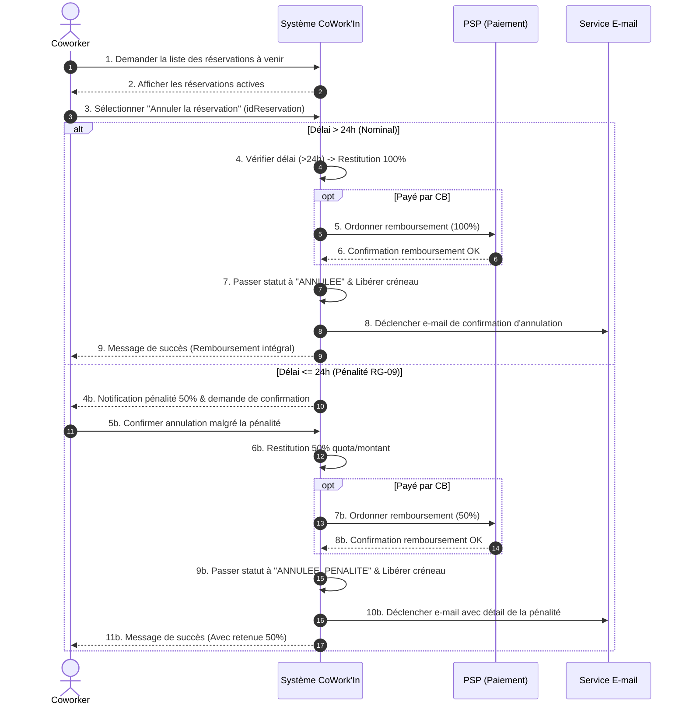

# Diagramme de Séquence Système — UC-04 : Annuler une réservation

## 1. Rendu Visuel (Diagramme Mermaid)

---

## 2. Analyse des Échanges Système

- **Entrées** : `idReservation`, identifiant de l'utilisateur authentifié.
- **Sorties** : Statut mis à jour, ordre de remboursement vers le PSP, notification d'annulation envoyée par mail, libération du créneau horaire de l'espace.
- **Opérations système identifiées** :
  1. `getReservationsAvenir(utilisateurId)`
  2. `annulerReservation(reservationId)`
  3. `calculerPenaliteAnnulation(reservationId)`
  4. `restituerQuotaAbonnement(utilisateurId, nbHeures)`
