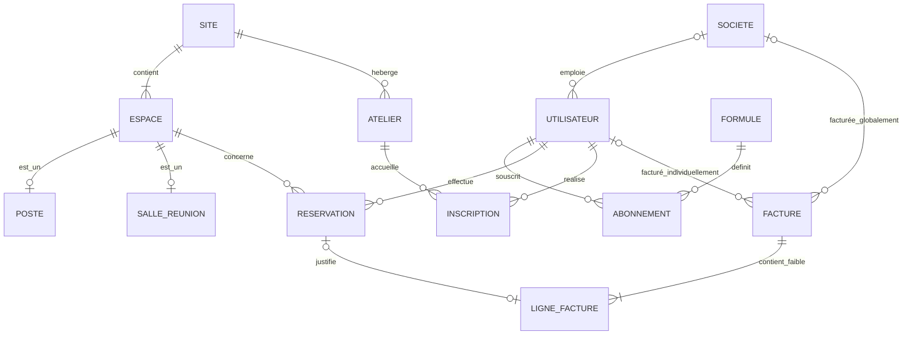

# Modèle Conceptuel de Données (MCD MERISE) — CoWork'In

## 1. Représentation Textuelle Structurée du MCD (Notations MERISE)

```text
SITE (1,1) <--- [Situer] ---> (1,N) ESPACE
SITE (1,1) <--- [Organiser] ---> (0,N) ATELIER

ESPACE (1,1) <--- [Spécialiser] ---> (0,1) POSTE
ESPACE (1,1) <--- [Spécialiser] ---> (0,1) SALLE_REUNION

UTILISATEUR (0,1) <--- [Appartenir] ---> (0,N) SOCIETE
UTILISATEUR (1,1) <--- [Souscrire] ---> (0,N) ABONNEMENT
FORMULE (1,1) <--- [Définir] ---> (0,N) ABONNEMENT

UTILISATEUR (1,N) <--- [Réserver] ---> (0,N) ESPACE
    Association : RESERVATION
    Propriétés : date_heure_debut, date_heure_fin, statut, montant_total

UTILISATEUR (0,N) <--- [Inscrire] ---> (0,N) ATELIER
    Association Porteuse : INCRIPTION
    Propriétés : date_inscription, statut_inscription

UTILISATEUR (0,1) <--- [Adresser_U] ---> (0,N) FACTURE
SOCIETE (0,1) <--- [Adresser_S] ---> (0,N) FACTURE

FACTURE (1,1) <--- (R) [Composer] ---> (1,N) LIGNE_FACTURE
    (R) = Identification Relative (Entité Faible LIGNE_FACTURE)

RESERVATION (0,1) <--- [Justifier] ---> (0,1) LIGNE_FACTURE
```

---

## 2. Diagramme Conceptuel MCD (Rendu Mermaid)



---

## 3. Traitement Détaillé des 4 Cas Délicats (Slide 50)

### 3.1 Cas Délicat 1 : Relation Porteuse de Données (`INSCRIPTION`)
- **Problème** : Où stocker `date_inscription` et `statut_inscription` ? Ces propriétés n'appartiennent ni à l'utilisateur individuellement, ni à l'atelier dans son ensemble.
- **Solution MERISE** : L'association `Inscrire` entre `UTILISATEUR` `(0,N)` et `ATELIER` `(0,N)` est une **relation porteuse**. Lors de la dérivation au MLD, elle devient une table de liaison `INSCRIPTION` contenant la clé composée `(id_utilisateur, id_atelier)` ainsi que ses attributs propres.

---

### 3.2 Cas Délicat 2 : Arbitrage de la Relation Ternaire (`SITE` x `UTILISATEUR` x `FORMULE`)
- **Problème** : Faut-il lier le site d'origine de l'utilisateur à sa formule d'abonnement au sein d'une association ternaire ?
- **Arbitrage** : La ternaire est **rejetée**. Un abonné CoWork'In (formule Nomade, Résident ou Team) bénéficie d'un accès multi-sites sur l'ensemble du réseau (Lille, Roubaix, Tourcoing). Décomposer en deux associations binaires (`Formule` -> `Abonnement` <- `Utilisateur` et `Utilisateur` -> `Site`) évite toute redondance et supprime les fausses dépendances fonctionnelles.

---

### 3.3 Cas Délicat 3 : Entité Faible et Identification Relative (`LIGNE_FACTURE`)
- **Problème** : Une ligne de facture n'a aucun sens d'existence sans la facture qui la contient.
- **Solution MERISE** : `LIGNE_FACTURE` est modélisée comme une **entité faible** (dépendance d'existence). La relation `Composer` utilise l'**identification relative** : la clé primaire de la ligne de facture sera composée de `(id_facture, num_ligne)`. Si la facture est supprimée, ses lignes disparaissent automatiquement (`ON DELETE CASCADE`).

---

### 3.4 Cas Délicat 4 : Historisation des Tarifs
- **Problème** : Si le gérant augmente le tarif mensuel d'une formule ou le tarif horaire d'une salle en octobre, les factures émises en septembre ne doivent pas voir leur montant recalculé rétroactivement !
- **Solution MERISE** :
  1. `RESERVATION` enregistre le champ figé `montant_total` au moment où la réservation est conclue.
  2. `LIGNE_FACTURE` duplique et enregistre en dur `prix_unitaire_ht` et `montant_ht` à la date de génération de la facture. Le catalogue tarifaire de `FORMULE` reste ainsi totalement indépendant de l'historique comptable immuable.
